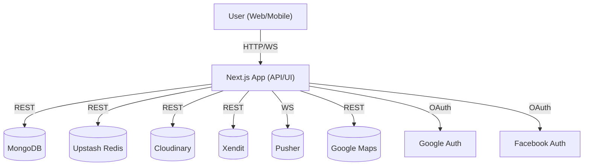
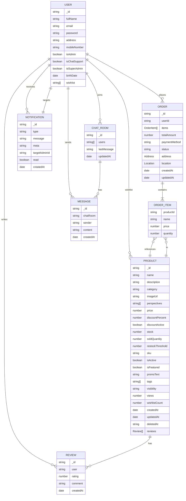

# Naty's Handicraft App

> **A modern, scalable, and maintainable e-commerce platform for handcrafted Filipino products.**

---

## Executive Summary

Naty's Handicraft App is a full-stack, cloud-native e-commerce solution designed for growth, maintainability, and developer happiness. It leverages Next.js, MongoDB, Upstash Redis, Cloudinary, and a suite of modern tools to deliver a seamless experience for customers, admins, and developers alike.

---

## Feature Matrix

| Area                 | Features                                                                            |
| -------------------- | ----------------------------------------------------------------------------------- |
| Product Catalog      | Pagination, filtering, search, product details, multi-image (Cloudinary), tags, SEO |
| Cart & Checkout      | Add/remove, quantity, summary, order placement, order history, Xendit payment       |
| User Auth/Profile    | Social login (Google/Facebook), profile, address, protected routes                  |
| Reviews & Ratings    | Verified purchase reviews, ratings, admin moderation                                |
| Wishlist             | Add/remove, per-user, wishlist count                                                |
| Admin Dashboard      | Analytics, product/order/user CRUD, status toggles, notifications                   |
| Notifications        | Real-time (Pusher), admin dropdown, mark as read                                    |
| Chat & Support       | Real-time user-support chat, typing/read indicators                                 |
| Performance          | Redis caching, cache invalidation, Next.js Image, code splitting                    |
| SEO & Metadata       | Dynamic OpenGraph/Twitter, canonical URLs, metadata API                             |
| Responsive UI        | Mobile-first, accessible, animated, modern UI                                       |
| Newsletter/Marketing | Newsletter overlay, featured/best-selling/new products                              |
| Payment              | Xendit integration, webhook handling                                                |
| Maps                 | Google Maps for address selection                                                   |

---

## Architecture



---

## Entity Relationship Diagram (ERD)



---

## Tech Stack & Rationale

- **Next.js (App Router):** Modern SSR/SSG, file-based routing, API routes, SEO, and React 18 features.
- **MongoDB + Mongoose:** Flexible, scalable, and familiar for e-commerce data models.
- **Upstash Redis:** Serverless, low-latency caching for product data, search, and session state.
- **Cloudinary:** Best-in-class image upload, transformation, and CDN delivery.
- **NextAuth:** Secure, extensible authentication with social providers.
- **Pusher:** Real-time chat and notifications with minimal ops overhead.
- **Redux Toolkit:** Predictable, scalable state management for complex UI flows.
- **Tailwind CSS + framer-motion:** Rapid, maintainable, and beautiful UI development.
- **Xendit:** Modern payment gateway for Southeast Asia.

---

## Getting Started

### 1. Clone & Install

```bash
git clone https://github.com/yourusername/natyshandicraft-app.git
cd natyshandicraft-app
npm install
```

### 2. Environment Variables

Copy `.env.example` to `.env.local` and fill in:

- `MONGODB_URI`, `UPSTASH_REDIS_URL`, `CLOUDINARY_*`, `NEXTAUTH_*`, `XENDIT_SECRET_KEY`, `PUSHER_*`, etc.

### 3. Run Locally

```bash
npm run dev
```

Visit [http://localhost:3000](http://localhost:3000)

---

## Deployment

- **Recommended:** [Vercel](https://vercel.com/) for zero-config Next.js hosting.
- Set all environment variables in your deployment dashboard.
- Use Upstash, Cloudinary, Xendit, and Pusher cloud services for production.

---

## Codebase Conventions

- **TypeScript everywhere:** Strict types for safety and clarity.
- **Feature-first structure:** Group related logic (UI, API, state) by feature.
- **API routes:** All backend logic in `/src/app/api/` for discoverability.
- **Reusable components:** All UI in `/src/components/`, styled with Tailwind.
- **Redux slices:** One slice per domain (`cartSlice`, `productSlice`, etc.).
- **Models & Types:** All Mongoose models in `/src/models/`, all TS types in `/src/types/`.
- **Hooks & Utils:** Custom hooks in `/src/hooks/`, helpers in `/src/utils/`.
- **Environment config:** Never hardcode secrets; always use env vars.

---

## Extensibility & Best Practices

- **Add new features by feature folder:** UI, API, state, and types together.
- **API versioning:** Use subfolders in `/api/` for breaking changes.
- **Testing:** Add unit/integration tests in `/src/tests/` (Jest/React Testing Library recommended).
- **CI/CD:** Integrate with GitHub Actions or Vercel for auto-deploys and checks.
- **Monitoring:** Use Vercel Analytics, Upstash metrics, and Cloudinary dashboard.
- **Security:**
  - Use HTTPS everywhere.
  - Validate all API input (server and client).
  - Use role-based access for admin routes.
  - Never expose secrets to the client.

---

## Security & Compliance

- **Authentication:** NextAuth with JWT, social login, and session expiry.
- **Authorization:** Role checks for admin endpoints and UI.
- **Data validation:** All API endpoints validate input and sanitize output.
- **Sensitive data:** Never logged or sent to the client.
- **Payments:** PCI compliance via Xendit; no card data stored on our servers.

---

## Testing

- **Unit tests:** For all business logic and reducers.
- **Integration tests:** For API routes and critical flows.
- **E2E tests:** (Recommended) Playwright or Cypress for user journeys.
- **Manual QA:** Use Vercel preview deployments for PR review.

---

## Challenges & Lessons Learned

- **Image payload bloat:** Solved by uploading all images to Cloudinary and storing only URLs (never base64/data URIs).
- **Cache invalidation:** Ensured all product mutations (create/update/delete/toggle) clear relevant Redis keys.
- **Real-time UX:** Used Pusher for chat/notifications, handling auth and connection edge cases.
- **SEO:** Leveraged Next.js metadata API for dynamic OpenGraph/Twitter tags.
- **Admin UX:** Built robust modals, tables, and analytics for easy management.
- **Data consistency:** Used Mongoose for schema validation and Upstash for fast cache.
- **Security:** Used NextAuth for secure authentication and role-based access control.

---

## Contribution Guidelines

- **Fork and branch:** Always work in a feature branch.
- **Code style:** Follow Prettier and ESLint rules. Use clear, descriptive names.
- **Testing:** Add/maintain tests for new features.
- **Pull requests:** Write clear PR descriptions. Reference issues if relevant.
- **Discussions:** For major changes, open an issue or discussion first.
- **Docs:** Update this README and code comments for new features.

---

## Contact & Credits

- Built for the Filipino artisan community, inspired by modern SaaS and e-commerce best practices.
- Uses open source tools and cloud services for scalability and speed.
- Maintained by [Your Name/Team].
